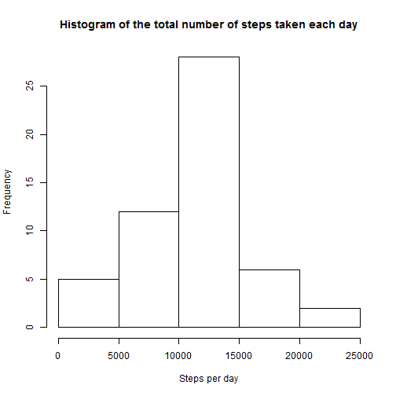
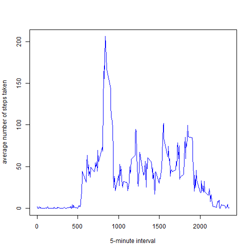
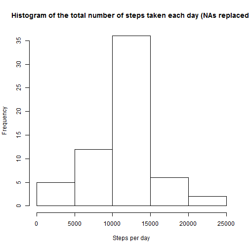

## Loading and preprocessing the data

**Instuctions**  
*Show any code that is needed to*  
*1- Load the data (i.e. read.csv())*  
*2- Process/transform the data (if necessary) into a format suitable for your analysis*

The following chunk:
- unzips activity.zip, which contains the data file, into the working directory and records the unzipping in unzip_time.txt. (The existing version of activity.txt will be overwritten).
- Loads activity.csv into data (a data frame) and converts the date column into date format.
- Reports summary() and head() of data. (commented out)


```r
unzip("activity.zip");
time <- as.character(Sys.time());
write(time, "unzip_time.txt");
data <- read.csv("activity.csv", 
                 header = TRUE, 
                 colClasses = c("integer", "character", "integer"));
data$date <- as.Date(data$date);
# summary(data); head(data);
```

activity.zip unzipped at 2014-12-14 20:51:08.  

## What is mean total number of steps taken per day?

**Instuctions**  
*For this part of the assignment, you can ignore the missing values in the dataset.*  
*1- Make a histogram of the total number of steps taken each day*  
*2- Calculate and report the mean and median total number of steps taken per day*  

The following chunk:
- Calculates the total number of steps taken each day and saves the result in 'steps_day'.
- Reports summary() and head() of steps_day. (commented out)
- Draw the histogram of the total number of steps taken each day.
- Calculates the median and the mean of the total number of steps taken each day and reports them.


```r
steps_day <- aggregate(data[,"steps"], list(data[,"date"]), sum);
names(steps_day) <- c("date", "tot_steps");
steps_day <- steps_day[!is.na(steps_day$tot_steps),]
# head(steps_day); summary(steps_day);

hist(steps_day$tot_steps, 
     main = "Histogram of the total number of steps taken each day",
     xlab = "Steps per day"
     );
```

 

```r
mean_steps_day <- mean(steps_day$tot_steps); median_steps_day <- median(steps_day$tot_steps);
mean_steps_day; median_steps_day;
```

```
## [1] 10766.19
```

```
## [1] 10765
```

the median and the mean of the total number of steps taken each day are 10765 and 1.0766189 &times; 10<sup>4</sup> respectively.

## What is the average daily activity pattern?

**Instuctions**  
*1- Make a time series plot (i.e. type = "l") of the 5-minute interval (x-axis) and the average number of steps taken, averaged across all days (y-axis)*  
*2- Which 5-minute interval, on average across all the days in the dataset, contains the maximum number of steps?*

The following chunk:
- For each interval, calculates the average number of steps taken across all days and saves the result in 'steps_interval'.
- Reports summary() and head() of steps_interval. (commented out)
- Plots a time series plot of "the average number of steps taken in each interval across all days" as a function of interval. (note: intervals are not of 'time' type as they are recorded in integer format. It doesn't matter for the purpose of this exercise, although I'm not sure if that's what the instructors intended.)
- Calculates maximum value of this parameter, finds its position in the data.frame as well as the corresponding time-interval.
- Reports the time-interval which, on average across all the days in the dataset, contains the maximum number of steps.


```r
steps_interval <- aggregate(data[,"steps"], list(data[,"interval"]), mean, na.rm = TRUE);
names(steps_interval) <- c("interval", "mean_steps");
# head(steps_interval); summary(steps_interval);

plot(steps_interval$interval, 
     steps_interval$mean_steps, 
     type = 'l',
     col = 'blue',
     xlab = '5-minute interval',
     ylab = 'average number of steps taken');
```

 

```r
max_value <- max(steps_interval$mean_steps);
max_position <- which(steps_interval$mean_steps == max_value);
max_value_interval <- steps_interval[max_position,]$interval;
# max_value; max_position;
max_value_interval
```

```
## [1] 835
```

835-interval contains, on average across all the days in the dataset, the maximum number of steps, i.e. 206.1698113.

## Imputing missing values

**Instuctions**  
*Note that there are a number of days/intervals where there are missing values (coded as NA). The presence of missing days may introduce bias into some calculations or summaries of the data.*  
*1- Calculate and report the total number of missing values in the dataset (i.e. the total number of rows with NAs)*  
*2- Devise a strategy for filling in all of the missing values in the dataset. The strategy does not need to be sophisticated. For example, you could use the mean/median for that day, or the mean for that 5-minute interval, etc.*  
*3- Create a new dataset that is equal to the original dataset but with the missing data filled in.*  
*4- Make a histogram of the total number of steps taken each day and Calculate and report the mean and median total number of steps taken per day. Do these values differ from the estimates from the first part of the assignment? What is the impact of imputing missing data on the estimates of the total daily number of steps?*

The following chunk:
- Calculates number of NAs in each column of 'data'. As 'steps' is the only column with NAs, the rest of the chunk focuses on that column. (commented out)
- As a double-check compares the number of observations in 'data' with number of intervals per day times number of days. (commented out)
- Reports total number of missing values.
- Divides 'data' into two dataframes. data_good (without NA) and data_bad (only NA). 
- Counts the total number of NAs per day in data_bad (commented out)  


### There exists 8 days, for which not a single observation is recorded. For the rest of the days, the number of steps for each and every interval is recorded. The strategy for replacing the NAs only needs to consider the mentioned 8 days.  

### A reasonable first-order approximation, which keeps the first-moment (mean) untouched, is the following: For each interval, replace the missing value with the average number of steps taken across all non-corrupt days.

The following chunk continues by:
- Replacing the NAs, as described above, by values from 'steps_interval' and saves the result in a new dataframe: 'data_new'.
- Drawing the histogram of the total number of steps taken each day (using data_new).
- Calculating the median and the mean of the total number of steps taken each day and reporting and comparing them with the respective values before replacing the NAs.


```r
# colSums(is.na(data))
# dim(steps_interval)[1]*dim(steps_day)[1]; dim(data)[1];

tot_na <-sum(is.na(data)); tot_na;
```

```
## [1] 2304
```

```r
data_bad <- data[is.na(data$steps),]
data_good <- data[!is.na(data$steps),]
# table(data_bad$date)


data_rep <- 
    merge(data_bad, steps_interval, by = "interval")[,c("interval", "mean_steps", "date")]
names(data_rep) <- c("interval", "steps", "date");
data_new <- rbind(data_good, data_rep);


steps_day_new <- aggregate(data_new[,"steps"], list(data_new[,"date"]), sum);
names(steps_day_new) <- c("date", "tot_steps");


hist(steps_day_new$tot_steps, 
     main = "Histogram of the total number of steps taken each day (NAs replaced)",
     xlab = "Steps per day"
     );
```

 

```r
mean_steps_day_new <- mean(steps_day_new$tot_steps); 
median_steps_day_new <- median(steps_day_new$tot_steps);
mean_steps_day_new; median_steps_day_new;
```

```
## [1] 10766.19
```

```
## [1] 10766.19
```

The total number of missing values in the dataset is 2304.

The median and the mean of the total number of steps taken each day are 1.0766189 &times; 10<sup>4</sup> and 1.0766189 &times; 10<sup>4</sup> respectively. (was 10765 and 1.0766189 &times; 10<sup>4</sup> before removing NAs).  

The mean value remains the same as an artifact of the described strategy but the median value could change - in this case it does - because the replaced values only mimic the mean and not other moments of the distribution.

## Are there differences in activity patterns between weekdays and weekends?

**Instructions**  
*For this part the weekdays() function may be of some help here. Use the dataset with the filled-in missing values for this part.*  
*1- Create a new factor variable in the dataset with two levels - "weekday" and "weekend" indicating whether a given date is a weekday or weekend day.*  
*2- Make a panel plot containing a time series plot (i.e. type = "l") of the 5-minute interval (x-axis) and the average number of steps taken, averaged across all weekday days or weekend days (y-axis). See the README file in the GitHub repository to see an example of what this plot should look like using simulated data.*

The following chunk:
- Creates a new factor variable 'weekend_factor' with two levels.  
- Creates a new dataframe 'data_weekend' with 3 fields: 'interval', 'weekend_factor', and 'avg_steps'  
- Loads lattice package and plots 2 graphs with a (1,2) layout.


```r
weekend_factor <- factor(
    weekdays(data_new$date) %in% c("Saturday", "Sunday") , 
    levels = c(TRUE, FALSE), 
    labels = c("weekday", "weekend"))

data_weekend <-  data.frame(data_new, weekend_factor = weekend_factor)

data_weekend <- aggregate(data_weekend[,"steps"], list(data_weekend[,"interval"],data_weekend[,"weekend_factor"]), mean);
names(data_weekend) <- c("interval", "weekend_factor", "avg_steps");


library(lattice);
```

```
## Warning: package 'lattice' was built under R version 3.0.3
```

```r
xyplot(avg_steps ~ interval | weekend_factor, data = data_weekend, layout = c(1, 2), ylab = "Number of steps", xlab = "Interval", type = 'l')
```

 


